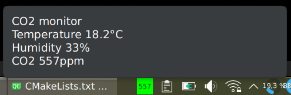

# air-monitor

This is a small simple app which sits in the tray widget of your desktop and displays the air quality.
It is useful in your home office to tell you when you have to open the window to get some fresh air.
The app maps the CO2 concentration to a continuous colour scale from green (good) via yellow (becoming bad)
to red (get fresh air). It also displays the temperature and humidity in a tooltip. The data are obtained by listening to an MQTT topic which is expected to publish the air measurements
in the form `{"temperature": 20.1, "humidity": 45, "co2": 729}`, expected units are degree Celsius for the temperature, percent for the humidity, and ppm for the CO2 concentration.

The program is written in C++ using Qt and libmosquitto as MQTT client. The MQTT server and topic is configured in a configuration file (using `QSettings`). The app is licensed under the GNU General Public license version 3. Don't forget to initialise and update the git submodule before building.
